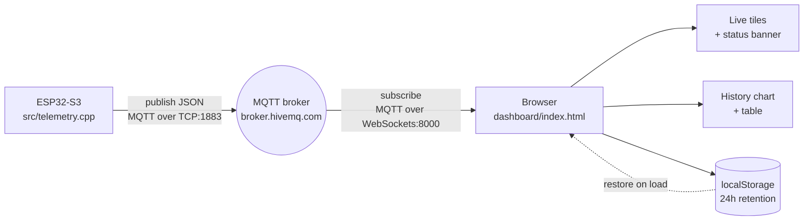

# SmartProbe Dashboard — how it works

Teaching notes for the live dashboard. Covers the architecture, the reasoning
behind each design decision, the known limitations, and the questions people
tend to ask.

---

## 1. The one-paragraph version

The probe measures grain-storage conditions and publishes each reading as a JSON
message to an MQTT broker over WiFi. The dashboard is a single static HTML file
that subscribes to those messages directly from the browser and redraws itself
whenever one arrives. There is no backend, no server-side code, and no database.
History is accumulated in the browser and saved to `localStorage`.

---

## 2. Architecture



The important structural point: **the probe and the dashboard never talk to each
other.** Both talk to the broker. The probe doesn't know whether anyone is
watching, and the dashboard doesn't know whether the probe is alive. This is the
publish/subscribe model, and it's the main idea to convey when teaching the system.

### The vocabulary you need

| Term | Meaning here |
|---|---|
| **Broker** | The middleman server every message passes through. We use the free public HiveMQ one. |
| **Topic** | A hierarchical address, `smartprobe/SP001/telemetry`. Publishers and subscribers agree on it; the broker just routes. |
| **Publish / subscribe** | The probe publishes; the browser subscribes. Neither needs the other's address. |
| **Wildcard** | `smartprobe/+/telemetry` — the `+` matches any single level, so one subscription catches every probe. |
| **QoS** | Delivery guarantee, 0–2. We use 0: fire and forget, no acknowledgement. |
| **Retained message** | The broker keeps the last message on a topic and hands it to new subscribers immediately. |
| **Last will (LWT)** | A message the broker publishes *on the client's behalf* if it disconnects unexpectedly. |

---

## 3. Following one reading end to end

**Firmware side** — [`src/telemetry.cpp`](../src/telemetry.cpp)

`performInspection()` in `src/system.cpp` runs every 30 seconds
(`inspectionInterval`). It reads the sensors, asks the Guardian for a verdict,
runs the TinyML prediction, and calls `publishReport()`.

`publishReport()` builds an `ArduinoJson` document with sixteen fields —
readings, Guardian status/cause/recommendation, actuator flags, ML trend and
confidence — serialises it into a 512-byte buffer, and publishes it to
`smartprobe/<PROBE_ID>/telemetry`.

Two details worth knowing. The PubSubClient default buffer is 256 bytes, which is
too small for this payload, so `initTelemetry()` calls
`mqtt.setBufferSize(512)`. And if WiFi or MQTT is down, `publishReport()` prints
`offline, skipping publish` and returns — **the reading is discarded, not queued.**

**Broker side**

The broker receives the message and forwards it to every client currently
subscribed to a matching topic. It stores nothing (our telemetry is not
retained), so a dashboard that connects one second later never sees it.

**Browser side** — [`dashboard/index.html`](index.html)

`connect()` opens an MQTT-over-WebSockets connection. WebSockets matter here:
browsers cannot open raw TCP sockets, so the normal MQTT port 1883 is unreachable
from JavaScript. The broker exposes the same MQTT protocol wrapped in WebSockets
on port 8000, which the browser *can* open.

On each message, `applyReport()` runs and does five things: updates the four stat
tiles, appends a reading to the `readings` array, saves to `localStorage`,
redraws the sparklines and history chart, and updates the status banner. If the
status is `CRITICAL` it also flashes the page and plays a tone, debounced to once
every 15 seconds.

---

## 4. The data model

One flat array. Each entry is a complete snapshot:

```js
{ t, temperature, humidity, voc, pressure, status }
```

Everything derives from it — the sparklines take the last 40 entries, the chart
filters by the selected time range and reads one field, the table renders all
fields newest-first. Keeping a single array rather than four separate series is
what makes the table and the tooltip's "other metrics" rows trivial.

**Retention** is time-based, not count-based: `prune()` drops anything older than
`RETENTION_MS` (24 hours), with `MAX_READINGS` (6000) as a secondary guard. Time
is the right axis for this because the sampling interval may change — a
count-based cap would silently mean something different if you moved the
inspection interval from 30 seconds to 5 minutes.

**Saving** is debounced by 300 ms, and if `localStorage` throws a quota error the
handler drops the oldest half of the array and retries once. At 30-second
sampling a day of readings is roughly 350 KB against a ~5 MB budget, so this is a
safety net rather than an expected path.

---

## 5. Design decisions and their reasons

These are the "why did you do it that way?" answers.

### Timestamps come from message arrival, not the payload

The firmware sends `doc["t"] = millis()` — milliseconds since the ESP32 booted.
That value resets to zero on every reset, so it cannot order readings across
restarts or be compared between two probes. It is unusable as a time axis.

Rather than block the chart on fixing the firmware, the browser stamps
`Date.now()` when the message arrives. The cost is network latency — a few
milliseconds against a 30-second sampling interval, which is noise.

**This is a deliberate trade, not an oversight**, and it has a known expiry date:
the moment anything stores readings server-side, or the firmware starts buffering
and replaying them, arrival time becomes wrong and the firmware needs real NTP
epoch timestamps.

### `localStorage` instead of a database

The dashboard is a static file with no backend. Adding a database means adding a
server process to subscribe and write, plus an API for the dashboard to read
history back. `localStorage` gets persistent history with neither.

The honest limitation: **the browser only records what it witnesses.** Close the
tab and nothing accumulates. It is a viewer that remembers, not a recorder. If
the requirement becomes "what were conditions last Tuesday," this design is wrong
and you need a broker-to-database bridge.

### The chart breaks across gaps instead of interpolating

`gapThreshold()` computes the median interval between readings and treats
anything beyond 3× that as a break, splitting the line into segments.

This matters because the probe *does* lose data — `publishReport()` discards
readings whenever WiFi is down. A continuous line across a 40-minute outage would
draw readings that were never taken. Showing a hole is the honest rendering, and
it makes the data-loss problem visible rather than hiding it.

### One metric at a time

Temperature (°C), humidity (%), VOC (raw ADC count) and pressure (hPa) have
incompatible scales. Plotting them together needs either two y-axes or
normalisation.

A dual-axis chart is the single most common charting mistake: the alignment
between the two scales is arbitrary, so the chart invents a correlation that
isn't in the data. We avoid it entirely — the metric selector shows one series
with one axis in its real units, and the four sparklines give the simultaneous
view.

### There is a table view

Two reasons. It's the accessible equivalent of the chart, so no value is
reachable only by hovering. And it satisfies a specific colour requirement: the
aqua used for VOC measures 2.74:1 contrast against the light background, below
the 3:1 threshold, which obliges the design to provide visible labels or a table
rather than relying on the line's colour. The chart also direct-labels its
endpoint for the same reason.

### The colours are not arbitrary

They're validated categorical slots — blue, orange, aqua, violet — checked for
lightness band, chroma, and colour-blind separation against both light and dark
backgrounds. Status colours (green/amber/red) are a *separate* reserved set that
never doubles as a series colour, and status is always shown as icon plus word,
never colour alone.

### The chart is hand-written SVG

No charting library. It's roughly 130 lines, avoids a dependency on a CDN that
must stay reachable, and keeps the whole dashboard a single file you can open
from disk. The trade-off is that axis ticks (`niceTicks()`), gap detection, and
the hover layer are all code you maintain yourself.

---

## 6. Known limitations

Be able to state these before anyone asks — knowing your system's weaknesses is
the difference between having built it and having copied it.

1. **History is per-browser and only recorded while the page is open.** Different
   laptop, different history. Clearing site data wipes it.
2. **No probe-offline detection.** The firmware carefully publishes a last-will
   and a retained birth message on `smartprobe/<id>/status`, and the dashboard
   never subscribes to it. If the probe dies, the dashboard shows stale values
   indefinitely. The connection dot reflects the *broker* connection, so it stays
   green. This is the most valuable gap to close next.
3. **Multiple probes would collide.** The topic uses the `+` wildcard but there's
   one set of tiles and one `readings` array, so two probes would overwrite each
   other and interleave into the same chart.
4. **Nothing is shown until the next message.** Telemetry is published
   non-retained, so a freshly opened dashboard is blank for up to 30 seconds.
   Publishing telemetry with the retain flag would fix this in one line.
5. **The public broker is unauthenticated and world-readable.** Anyone who knows
   the topic can read your data or publish fake readings. Fine for a
   demonstration; a private broker with credentials is required for a real
   deployment.
6. **The probe drops readings when offline.** No buffer in the firmware — see the
   discussion of a RAM ring buffer plus NTP timestamps.
7. **Chart granularity is capped by the inspection interval.** Currently 30
   seconds, and mode or actuator changes don't push an immediate update, so the
   Mode/Actuators tile can lag by that much.

---

## 7. Questions you should expect

**"Why MQTT rather than HTTP?"** MQTT is designed for constrained devices and
intermittent links: the client holds one long connection instead of paying TCP
and HTTP handshake costs per reading, the protocol overhead is a couple of bytes
per message, and last-will gives you death detection for free. Publish/subscribe
also means adding a second consumer — a logger, a phone app — requires no change
to the firmware.

**"What happens if two probes publish at once?"** Today they'd collide in the UI
(limitation 3). The fix is keying `readings` by probe ID and rendering either a
selector or one card per probe. The topic structure already supports it.

**"Is the data secure?"** No. Public broker, unencrypted `ws://`, no
authentication. The mitigation path is a private Mosquitto instance with username
and password, `wss://` for TLS, and per-probe credentials.

**"How much data can it hold?"** 24 hours by retention, 6000 readings by hard cap,
roughly 350 KB against a ~5 MB `localStorage` budget. Quota errors are handled by
dropping the oldest half.

**"Why doesn't it use a charting library?"** Single file, no external dependency,
no CDN that has to stay up. About 130 lines of SVG.

**"What if the browser is closed overnight?"** You get a gap. That's the central
limitation of browser-side recording, and the reason a broker-to-database bridge
is the natural next step.

---

## 8. Running it

```bash
python3 -m http.server 8080 --directory dashboard
```

Then open `http://localhost:8080`.

Use a server rather than opening the file directly — browsers treat `file://`
origins inconsistently for storage, so history may silently fail to persist.
Port 8080 avoids confusion with HiveMQ's WebSocket port, which is also 8000.

To view from a phone on the same network, get the machine's address with
`ipconfig getifaddr en0` and open `http://<that-ip>:8080`.

If you ever serve this over HTTPS, the broker field must change to
`wss://broker.hivemq.com:8884/mqtt` — browsers block insecure `ws://` from a
secure page as mixed content.
